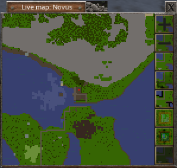
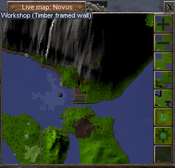
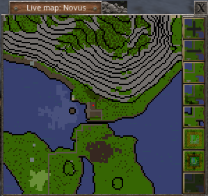
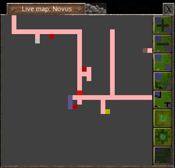

# Live HUD Map for Wurm Unlimited

Sponsored by [Razors Edge (Ages of Urath Saga)](http://forum.wurmonline.com/index.php?/topic/133419-razors-edge-ages-of-urath-saga/) Server

## Installation
Requires [client modloader](https://github.com/ago1024/WurmClientModLauncher/releases/latest)

* Download `livemap.zip`
* Extract `livemap.zip` into client folder (the jar should land in `mods/livemap/livemap.jar`)
* Enjoy

   

## Known Issues

* The 3D view may scroll out of range when walking up a high mountain
* Your player location marker may end up behind a mountain in 3D view

## Sklo Settings
Set your prefered server in the property files

## In-Game Commands

`toggle livemap`
